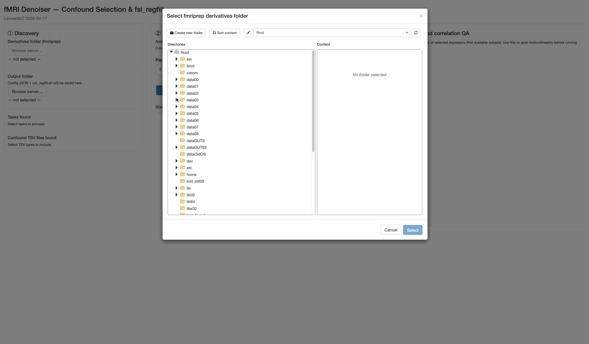

# MRI Hackaton

_LC 2026-04-19_


# Organization of code + data
The main principle of working on storm is to have
- scripts in `/data00/[yourname]/[projectName]`
- data in `/data03` (or any other windoze disk)

<br>

`data00` 
  - is the only disk physically connected to storm, and it's the fastest, but it's also the smallest, and we should _not_ store data there. 
  - is not backed-up, therefore I strongly advise you, when you start a project, to also create a new github repo in `/data00/[yourname]/[projectName]` and link it to the remote repo on github
  - github is perfect since scripts are small - and even if you need to place some images, e.g. some MNI.nii.gz, it's ok. For big files that you might want to (temporarily) have in `data00`, there is `.gitignore`

<br>

`data[03-06]`
  - are bigger (if there is still space available), but much slower
  - they are windoze disks connected via network, therefore some linux operations (e.g. symbolic links) are not allowed. The simplest example of this is a python virtual environment, which is another reason why we need to keep the scripts on `data00`
  - they are automatically backed up
  - they need to have the typical data curation structure, with e.g. one folder for `Data_collection` and another for `Data_analysis`

Where to store the preprocessed data? For the time being, we will choose to keep them in `Data_collection`, since they do not implement any analyses. But this is flexible according to needs.


# Environment setup

## VS code
We will work mostly inside VS code and in the terminal, therefore make sure you have installed [VS code](https://code.visualstudio.com/) on your laptop.

## ssh key
Make sure that you have: 
- an ssh key in your `.ssh` folder 
- already added the **public** key to the `.ssh/authorized_keys` on storm
- a `config` file in your local `.ssh` folder with the info to connect to storm (see below for an example)

```bash
# local (i.e. your laptop)
$ cd .ssh
~/.ssh
$ ls -lha
total 48
-rw-r--r--@  1 leonardo  staff   103B Jan  7  2025 config
-rw-------   1 leonardo  staff   3.3K Jan  7  2025 id_rsa
-rw-r--r--   1 leonardo  staff   747B Jan  7  2025 id_rsa.pub

# if you do not have the files above, you can create them with
# ssh-keygen -t rsa -b 4096

~/.ssh
$ cat config 
Host storm
    HostName storm.herseninstituut.knaw.nl
    User cerliani
    IdentityFile ~/.ssh/id_rsa

# remote (i.e. on storm)
leonardo@storm:~/.ssh$ cat authorized_keys 
ssh-rsa AAAAB3Nz ... 8o+lFyI4qfPWQ== sbl_terminal_tut@itanos.local
```

## github account
Make sure you have also created an `.ssh` key in your `~/.ssh` folder on storm, and have uploaded the **public** key to your github account, so that you can push repos modifications to remote. If you do not have the files above, you can create them with `ssh-keygen -t rsa -b 4096` inside the `~/.ssh` folder.


## fsl
Make sure fsl is in the `$PATH`
- `which fsl`
- if it's not in the path, you need to add the following to yourr `~/.bashrc` file
- `ls -lha` is better than `ls`, and `tree` is also very useful to see the structure of subfolders

```bash
FSLDIR=/usr/local/fsl

PATH=${FSLDIR}/share/fsl/bin:${PATH}
export FSLDIR PATH
. ${FSLDIR}/etc/fslconf/fsl.sh
```

## pydeface
Make sure `pydeface` is installed (`which pydeface`) should be not null

## docker
Make sure you are in the docker group
  - giving the command `id` from the terminal would show you which groups you are in. Make sure that there is also `docker` among them, otherwise ask me.

## niivue plugin for VS code
- Install the [niivue plugin for VS code](https://marketplace.visualstudio.com/items?itemName=KorbinianEckstein.niivue)
  - This allows inspecting the images on storm (and to add overlays!) directly from your local VS code

## python virtual environments
Learn the very basic of python virtual environments (hereafter venv). 

```bash
# e.g. for a virtual environment called venv_MRI_hackaton
python -m venv venv_MRI_hackaton

# to activate (then shown in the prompt)
source venv_MRI_hackaton/bin/activate

# now you can pip install inside the venv

# to deactivate
deactivate
```

We will (try to) use one single venv that you will store in your project folder on `data00`. For the present code, it is at `/data00/MRI_hackaton/scripts/venv_MRI_hackaton`

Whenever you install something new in your venv, make sure (after testing) that you export it to a `requirements.txt` file so that it will stay in the github repo, and whoever clones it will know how to reproduce your analyses with the same python packages.

This can be simply achieved by issuing the following once the venv is activated: `pip freeze -r requirements.txt`

## Github
Learn the very basic of github (`git add/commit/push`)

Especially, get used to the `.gitignore` file. For instance, we will store all the directories (hereafter dirs) with python virtual environments in there (`venv*/`) 


## Utilities that make life easier
- use `batcat` instead of `cat` (`alias cat='batcat -p'`)
- use `btop` instead of `top` (`/usr/bin/btop`)
- `tmux`?


<br>


# 00. Set up the hackaton folder in /data00 and clone your fork of the github repo
- Fork [the hackaton repo](https://github.com/leonardocerliani/MRI_hackaton) in your github account
- Go on storm, in `/data00/[your name]` and clone the _forked_ repo from your account (i.e. _not_ the one above)
  - make sure you use the SSH option to clone it 

It should look something like this:

```bash
git clone git@github.com:leonardocerliani/MRI_hackaton.git
```

<br>

# 01. Bidsification with bidscoin
[ref to GUTs tut 05_full_pipeline](https://github.com/leonardocerliani/GUTS_fmri_preproc/tree/main/TUT/05_full_pipeline)

Create a data structure suitable for bidscoin. The one for the sample data of this hackaton is shown below

<details><summary>PARREC data structure</summary>

```
/data03/MRI_hackaton_data/PARREC/
├── sub-gutsaumc0010
│   └── ses-01
│       ├── sub-gutsaumc0010_ses-01_T1w_6_1.PAR
│       ├── sub-gutsaumc0010_ses-01_T1w_6_1.REC
│       ├── sub-gutsaumc0010_ses-01_task-fmrirest_bold_2_1.PAR
│       └── sub-gutsaumc0010_ses-01_task-fmrirest_bold_2_1.REC
├── sub-gutsaumc0011
│   └── ses-01
│       ├── sub-gutsaumc0011_ses-01_T1w_6_1.PAR
│       ├── sub-gutsaumc0011_ses-01_T1w_6_1.REC
│       ├── sub-gutsaumc0011_ses-01_task-fmrirest_bold_2_1.PAR
│       └── sub-gutsaumc0011_ses-01_task-fmrirest_bold_2_1.REC
...
└── sub-gutsaumc0017
    └── ses-01
        ├── sub-gutsaumc0017_ses-01_T1w_6_1.PAR
        ├── sub-gutsaumc0017_ses-01_T1w_6_1.REC
        ├── sub-gutsaumc0017_ses-01_task-fmrirest_bold_2_1.PAR
        └── sub-gutsaumc0017_ses-01_task-fmrirest_bold_2_1.REC
```

</details>

<br>

If there are some fmri acquisitions which were prematurely terminated, make sure you trim the PAR files for dcm2niix to be able to convert them to nifti

Choose which `dcm2niix` will be used by bidscoin
```bash
export dcm2niix="/usr/local/fsl/bin/dcm2niix"
```

Install `bidscoin` in a venv

```bash
# cd to the location in data00 where you want to store your venv
python3 -m venv venv_MRI_hackaton
source venv_MRI_hackaton/bin/activate
pip install bidscoin
```

Once the venv is activated, `cd` to the dir where your `PARREC` dir is and start the bidsmapper. I would suggest to use only a few subs for the bidsmapper (5-10) since otherwise it takes lots of time.

`bidsmapper PARREC/ bids/`

Once the mapping is satisfactory and saved, run the bidscoiner

`bidscoiner PARREC/ bids/`

You should end up with something like this:

<details><summary>bids data structure</summary>

```
bids/
├── README
├── code
│   └── bidscoin
│       ├── bidscoiner.errors
│       ├── bidscoiner.log
│       ├── bidscoiner.tsv
│       ├── bidsmap.yaml
│       ├── bidsmapper.errors
│       └── bidsmapper.log
├── dataset_description.json
├── participants.json
├── participants.tsv
├── sub-gutsaumc0010
│   └── ses-01
│       ├── anat
│       │   ├── sub-gutsaumc0010_ses-01_acq-ses01_T1w.json
│       │   └── sub-gutsaumc0010_ses-01_acq-ses01_T1w.nii.gz
│       ├── func
│       │   ├── sub-gutsaumc0010_ses-01_task-rest_bold.json
│       │   └── sub-gutsaumc0010_ses-01_task-rest_bold.nii.gz
│       └── sub-gutsaumc0010_ses-01_scans.tsv
...
└── sub-gutsaumc0017
    └── ses-01
        ├── anat
        │   ├── sub-gutsaumc0017_ses-01_acq-ses01_T1w.json
        │   └── sub-gutsaumc0017_ses-01_acq-ses01_T1w.nii.gz
        ├── func
        │   ├── sub-gutsaumc0017_ses-01_task-rest_bold.json
        │   └── sub-gutsaumc0017_ses-01_task-rest_bold.nii.gz
        └── sub-gutsaumc0017_ses-01_scans.tsv
```
</details>
<br>

Finally, feed the created `bids` folder into the [bidsvalidator](https://bids-standard.github.io/bids-validator/). Warnings are ok. Errors should be corrected, because fmriprep and other bisapps  process _only_ data which has passed the bidsvalidator without errors.


# 02. Anonymization with pydeface
[ref to GUTs tut 05_full_pipeline](https://github.com/leonardocerliani/GUTS_fmri_preproc/tree/main/TUT/05_full_pipeline)

```bash
# if it's the first time you run it, install it in your venv first
# pip install pydeface

n_parallel_processes=10

find bids -type f -name "*T1w*nii.gz" | xargs -n 1 -P ${n_parallel_processes} pydeface

# runnin with nohup guarantees that it will not stop 
# if for some reason your session disconnects 
# tmux is an even better option (to be explored)

# nohup bash -c 'find bids -type f -name "*T1w*nii.gz" | xargs -n 1 -P ${n_parallel_processes} pydeface' > deface.log 2>&1 &
```

pydeface will produce an image with the same name as the original `*T1w.nii.gz` but with the suffix `*T1w_defaced.nii.gz`. Once we have checked that everything went fine, we can overwrite the original with the defaced version, so that we keep just the anonymized T1. The original image can be regenerated from the PARREC if necessary.

```bash
for f in $(find bids -type f -name "*T1w_defaced.nii.gz"); do
    mv "$f" "${f/_defaced/}"
done
```


# 03. Skullstripping with synthstrip
[ref to 10_skull_stripping](https://github.com/leonardocerliani/GUTS_fmri_preproc/tree/main/TUT/10_skull_stripping)

[Synthstrip](https://surfer.nmr.mgh.harvard.edu/docs/synthstrip/) is an alternative to other sw for skull stripping (such as `bet` and `ANTs`). It is very recent and it uses DNN. It's superfast and it comes with freesurfer, but we will use the [docker version](https://hub.docker.com/r/freesurfer/synthstrip).

The idea of running synthstrip now is to prepare in case fmriprep returns an unsatisfactory skull stripping. In that case, we will already have the skullstripped version of the T1w carried out with synthstrip, and we will be able to rerun it with the latter with minimal additional procedures. In brief:

1. `cp *T1w.nii.gz` -> `*ORIG_T1w.nii.gz`

2. add `**/*ORIG*` to `.bidsignore` so that the bidsvalidator is happy

3. run fmriprep with the original `*T1w.nii.gz`

- Iff the skull stripping on the original T1w is satisfactory, live happily ever after

- Otherwise, just `cp *ORIG_T1w_brain.nii.gz` -> `*T1w.nii.gz` and re-run fmriprep enforcing `--skull-strip-t1w skip`
    
<br>


**NB**: since our data is on windoze drives, we need to change one detail in the `synthstrip-docker` provided on the website:

```bash
# Set UID and GID to avoid output files owned by root
# user = '-u %s:%s' % (os.getuid(), os.getgid())
user = ""  # instead of '-u %s:%s' % (os.getuid(), os.getgid())
```

To do them in parallel, there are several ways. Here's one very concise one using a temporary file for the T1s to be skull stripped. Note that it is designed to have the same effect over re-runs (idempotency, a good practice).


```bash
bids_root="/data03/MRI_hackaton_data/Data_collection/bids"

n_parallel_processes=10

# Exclude *ORIG_T1w.nii.gz so re-runs don't reprocess the backup
find "${bids_root}" -type f -name "*T1w.nii.gz" ! -name "*ORIG*" > T1s_list.txt

xargs -a T1s_list.txt -P ${n_parallel_processes} -I {} bash -c '
    f="{}"

    # Store ORIG files in ORIGINAL_T1W/ (ignored by bidsvalidator via **/*ORIG* in .bidsignore)
    anat_dir=$(dirname "${f}")
    orig_dir="${anat_dir}/ORIGINAL_T1W"
    mkdir -p "${orig_dir}"
    ORIG="${orig_dir}/$(basename ${f/T1w.nii.gz/ORIG_T1w.nii.gz})"
    [ ! -f "${ORIG}" ] && cp "${f}" "${ORIG}"

    out_img="${ORIG/.nii.gz/_brain.nii.gz}"
    out_mask="${ORIG/.nii.gz/_brain_mask.nii.gz}"

    ./synthstrip-docker-mod.sh \
        -i "${ORIG}" \
        -o "${out_img}" \
        -m "${out_mask}" \
        -t 10 \
        --no-csf
' # <- note the closing quote

rm T1s_list.txt
```

Now you can use the [niivue plugin for VS code](https://marketplace.visualstudio.com/items?itemName=KorbinianEckstein.niivue) to inspect the results of the skull stripping


# 04. fMRIprep 
To generate confounds.tsv file + registration and fmri 4D in MNI using ANTs.

The procedure is described in details in the [fmriprep.md](./procedures/fmriprep.md) document.

Everything is handled by the unified `scripts/run_fmriprep.sh` script. Before running it, set the two key parameters at the top:

```bash
SKULL_STRIP_PROCEDURE="synthstrip"   # "synthstrip"  or  "fmriprep"
deriv_root="/data03/.../fmriprep_synthstrip"   # adjust output directory accordingly
```

| `SKULL_STRIP_PROCEDURE` | What happens | `--skull-strip-t1w` |
|------------------------|--------------|---------------------|
| `synthstrip` | copies `ORIGINAL_T1W/*_ORIG_T1w_brain.nii.gz` → `anat/*_T1w.nii.gz` | `skip` |
| `fmriprep`   | restores `ORIGINAL_T1W/*_ORIG_T1w.nii.gz` → `anat/*_T1w.nii.gz` | `force` |

The script is **idempotent**: you can switch between modes at any time because the original full-head T1w is always safe in `ORIGINAL_T1W/` and is never overwritten. Subjects are processed in batches of `batch_size` with the `work_dir` cleaned between each batch to manage disk space.

```bash
nohup ./scripts/run_fmriprep.sh >> fmriprep.log 2>&1 &
tail -f fmriprep.log
```


# Additional preprocessing steps after fmriprep
### Highpass filtering via a cosine basis

A cosine (DCT) basis is a set of cosine waves of increasing frequency. When these are included as nuisance regressors in the GLM, the model "absorbs" all the low-frequency variance they represent — the residuals are therefore clean of those frequencies. This is mathematically equivalent to a highpass filter, but integrated directly into the regression step, avoiding the double-filtering problem that arises when you first filter the data and then fit a model.

The number of basis functions is chosen by the desired cutoff period T_c (e.g. 180 s) and the total scan duration T (= number of TRs × TR):

$$k = floor(2 × T / T_c)$$

For example, with TR = 2 s, 300 TRs (T = 600 s), and T_c = 180 s: k = floor(1200/180) = __6 cosines__. Including these 6 regressors removes all signal with period > 180 s (i.e. everything below ~5.5 mHz).

---

### Grand mean scaling

The BOLD signal is in arbitrary scanner units — the absolute intensity depends on scanner gain, coil placement, head size, and other technical factors that vary across subjects. Grand mean scaling fixes this by dividing each session's 4D volume by a single number (its global mean) and multiplying by 10 000. After scaling, a beta coefficient of, say, 150 units means a 1.5 % signal change from the mean __for every subject__. Without scaling, a beta of 150 could mean 1.5 % for one subject and 6 % for another, depending on their scanner settings — making any group-level (higher-order) comparison invalid. That is what FSL means by "necessary for higher-level analyses to be valid".

An alternative way of normalizing the signal would be using percent signal change voxelwise.

- __Grand mean scaling__ (global): divide the entire 4D volume by __one number__ — the mean across all brain voxels and all timepoints — then multiply by 10000. Spatial variation between voxels is preserved (WM is still brighter than GM). A beta of 150 means 1.5% of the global mean.

- __Voxel-wise PSC__: divide each voxel's timeseries by __its own mean__ (then × 100). After this, every voxel has mean = 100, spatial variation is removed (WM and GM look identical in the mean image). Betas are directly in %.

Grand mean scaling is preferred for GLM analyses because dividing by a voxel's own mean can __amplify noise__ in low-signal voxels (ventricles, skull edges) — their mean is near zero, so dividing by it inflates variance. That said, voxel-wise PSC conversion is sometimes applied __after__ the GLM (to convert betas to % for reporting) — that is fine because it is just a linear rescaling of already-computed values.

For connectivity analyses (FC, ISC), neither matters since correlations are scale-invariant.


---

### Smoothing with `3dBlurToFWHM`

A fixed Gaussian kernel (e.g. `fslmaths -s`) applies the same amount of smoothing regardless of how smooth the data already is. MNI-registered fMRI data already has some spatial smoothness introduced by interpolation during registration. Applying a fixed kernel on top of that can overshoot the target FWHM.

`3dBlurToFWHM` first __estimates the current spatial smoothness__ of the image and then applies only as much additional smoothing as needed to reach the target FWHM — iteratively, until convergence. The result is guaranteed to have exactly the requested FWHM. Since AFNI is not installed on the server, we run it via its official Docker image.

---

<br>

# 05. Additional confounds generation (cosine basis)
Generate cosine predictors as temporal filtering step (those generated by fmriprep have a specific frequency)

The procedure is carried out using `scripts/make_cosine_basis.py`, which can be run in parallel for all confounds tsv files generated by fmriprep (it's very fast) using xargs. It is described in [cosine_HP_filter.md](./procedures/cosine_HP_filter.md).

```bash
export deriv_dir="/data03/MRI_hackaton_data/Data_collection/fmriprep"
export cosine_cutoff=180          # highpass cutoff in seconds
n_parallel=10
list_subj="/data00/MRI_hackaton/scripts/list_subj.txt"

# activate the venv so python has nibabel / numpy / pandas
source /data00/MRI_hackaton/scripts/venv_MRI_hackaton/bin/activate

xargs -a "${list_subj}" -n1 -P${n_parallel} -I{} bash -c '
    sub="{}"
    echo "=== ${sub}: cosine HP basis (${cosine_cutoff}s cutoff) ==="
    for bold in $(find "${deriv_dir}/${sub}" -name "*_desc-preproc_bold.nii.gz" | sort); do
        python /data00/MRI_hackaton/scripts/make_cosine_basis.py "${bold}" ${cosine_cutoff}
    done
'
```


<br>

# 06. Confounds regression with fsl_regfilt
nuisance regression of acompcor (5 PC) + aroma components + sin/cos basis in fsl_regfilt  

`fsl_regfilt` is a very simple command to run from the terminal, passing the original preprocessed bold file, the txt file of the confounds and an index of the columns to remove. 

However when there are 10s/100s of subjects, tasks, runs, it is impractical to run it for each selection, and actually the tough part of a purely CLI interface is the selection of the confounds to add (the number of which can be 100+).

In this case we solved the procedure by creating a simple [Shiny app](localhost:3838/http://localhost:3838/fmri_denoiser/) (on storm) that allows to make this selection using a UI, and takes as input the output derivatives of fmriprep. It scans for the `*confounds.tsv` generated by fmriprep as well as for other confounds tsv files (e.g. from aroma or custom cosine basis) provided that they have the extension `.tsv` and the string `confounds` in the filename.

Once the user has made her selection, the app generates a confound `.txt` file in the original fmriprep derivative folder (for each sub/task/run) as well as a bash script `run_regfilt.sh` to run the actual denoising. 

The configuration is also saved in a json file `denoising_config.json`, so that different configurations can be generated (and reloaded in the app) for checking the selection and to run different iterations with different selections of confounds.



# 07. Grand Mean scaling

BOLD signal intensity is in arbitrary scanner units that vary across subjects (scanner gain, coil placement, head size, etc.). Grand mean scaling removes this inter-subject variability by setting the mean signal of each session to a fixed value — conventionally **10 000** in FSL. After scaling, a beta coefficient of, say, 150 units means the same thing for every subject (a 1.5 % change from the mean), making second-level analyses and between-subject comparisons valid.

The scaling is **global** (one number per session, not per voxel), so the spatial structure of the image — and the relative contrast between grey matter, white matter and CSF — is fully preserved.

`fslmaths` has a dedicated flag for intensity normalisation:

```bash
# -ing <mean> : intensity normalisation — divides by the global 4D mean and multiplies by <mean>
fslmaths denoised_bold.nii.gz -ing 10000 scaled_bold.nii.gz
```

Equivalently (to make the two steps explicit):

```bash
mean=$(fslstats denoised_bold.nii.gz -M)
fslmaths denoised_bold.nii.gz -div ${mean} -mul 10000 scaled_bold.nii.gz
```

In parallel across subjects using `scripts/list_subj.txt` (one line = one subject ID = one directory name in the fmriprep derivatives):

```bash
export deriv_dir="/data03/MRI_hackaton_data/Data_collection/fmriprep"
n_parallel=10  # desired number of parallel processes
list_subj="/data00/MRI_hackaton/scripts/list_subj.txt"

xargs -a "${list_subj}" -n1 -P${n_parallel} -I{} bash -c '
    sub="{}"
    echo "=== ${sub}: grand mean scaling ==="
    for in in $(find "${deriv_dir}/${sub}" -name "*_desc-denoised_bold.nii.gz" | sort); do
        out="${in/_desc-denoised_bold.nii.gz/_desc-scaled_bold.nii.gz}"
        fslmaths "${in}" -ing 10000 "${out}"
        echo "  Scaled: $(basename ${out})"
    done
'
```

This runs `n_parallel` subjects simultaneously; within each subject all BOLD files are processed sequentially. Adjust `n_parallel` to match available CPUs.

> **Note for connectivity analyses**: correlations are scale-invariant, so grand mean scaling does not affect FC or ISC results. It is nonetheless good practice and costs nothing.


# 08. Smoothing

Spatial smoothing increases SNR and helps account for residual inter-subject registration differences. We use [`3dBlurToFWHM`](https://afni.nimh.nih.gov/pub/dist/doc/program_help/3dBlurToFWHM.html) from AFNI rather than a fixed-kernel tool (e.g. `fslmaths -s`).

The key difference: a fixed Gaussian kernel applies the same amount of smoothing regardless of the data's pre-existing smoothness. MNI-registered fMRI data already has some spatial smoothness from the interpolation, so a fixed kernel can over-smooth. `3dBlurToFWHM` instead **estimates the current smoothness** of the image and then applies only as much additional smoothing as needed to reach the target FWHM — iteratively. The output is guaranteed to have exactly the requested FWHM.

Since AFNI is not installed on Storm, we run it via the official Docker image (`afni/afni`). Make sure you are in the docker group (`id` → check for `docker`; if not, ask to be added with `sudo usermod -aG docker <yourname>`).

**Single-file example** (to understand the components):

```bash
in="sub-001_ses-01_task-rest_space-MNI152NLin2009cAsym_res-2_desc-scaled_bold.nii.gz"
mask="${in/_desc-scaled_bold.nii.gz/_desc-brain_mask.nii.gz}"
out="${in/_desc-scaled_bold.nii.gz/_desc-smoothed_bold.nii.gz}"
in_dir=$(dirname "${in}")

docker run --rm \
    -e OMP_NUM_THREADS=2 \
    -v "${in_dir}:${in_dir}" \
    afni/afni \
    3dBlurToFWHM \
        -input "${in}" \
        -mask  "${mask}" \
        -FWHM  6 \
        -prefix "${out}"
```

- `-v "${in_dir}:${in_dir}"` mounts the subject's `func/` directory at the same absolute path inside the container, so all paths work transparently
- `-FWHM 6` targets 6 mm FWHM (a common choice for group-level fMRI); adjust to taste
- `-mask` restricts smoothing to brain voxels — the brain mask output by fMRIprep (`*_desc-brain_mask.nii.gz`) lives in the same directory as the BOLD
- `OMP_NUM_THREADS=2` limits each container to 2 threads; multiply by `n_parallel` to get total CPU usage

**Batch across subjects** using `scripts/list_subj.txt` (same pattern as grand mean scaling):

```bash
export FWHM=6          # desired smoothing kernel in mm
export n_parallel=10
export deriv_dir="/data03/MRI_hackaton_data/Data_collection/fmriprep"
list_subj="/data00/MRI_hackaton/scripts/list_subj.txt"

xargs -a "${list_subj}" -n1 -P${n_parallel} -I{} bash -c '
    sub="{}"
    echo "=== ${sub}: smoothing ==="
    for in in $(find "${deriv_dir}/${sub}" -name "*_desc-scaled_bold.nii.gz" | sort); do
        in_dir=$(dirname "${in}")
        mask="${in/_desc-scaled_bold.nii.gz/_desc-brain_mask.nii.gz}"
        out="${in/_desc-scaled_bold.nii.gz/_desc-smoothed_bold.nii.gz}"
        docker run --rm \
            -e OMP_NUM_THREADS=2 \
            -v "${in_dir}:${in_dir}" \
            afni/afni \
            3dBlurToFWHM \
                -input  "${in}" \
                -mask   "${mask}" \
                -FWHM   ${FWHM} \
                -prefix "${out}"
        echo "  Smoothed: $(basename ${out})"
    done
'
```

The first run will pull the `afni/afni` image from Docker Hub if not already cached (~2 GB, one time only).


# Signal averaging over parcellation schemes
parcellation step to average timeseries according to ROIs


# Useful Snippets

## Launch http server on storm to view reports locally
```
# on storm, in a terminal
cd [fmriprep derivatives folder]

# use here your favourite port number between 9000..9999, e.g. 9876
python -m http.server 9876
```

Now open the same port on the VS code connected to storm.

Finally, open a browser and visit `localhost:9876`

## Templateflow
Templateflow has been installed in `/data00/templateflow` and the actual MNI templates are in `MNI_templates`. 

It requires datalad and git-annex, which I installed with apt-get (installing with pip runs in an old-version conflict between the two). Below is the procedure, for the record, but they are already there.

You can use the lines below to download new template. Just replace the value of `template="[desired template]"`.  Check which templates are already available in `/data00/MNI_templates` before downloading them again.

```bash
# INSTALLATION OF GIT-ANNEX AND TEMPLATE FLOW ALREADY DONE
# sudo needs to install git annex in advance (done)
# sudo apt update
# sudo apt install git-annex
# sudo apt-get install datalad
# cd /data00
# datalad install -r ///templateflow

# now download the template you want
cd /data00/templateflow

template="tpl-MNI152NLin2009cAsym"

datalad get -r ${template}

# you only get the links, so now you need to get the files
source="/data00/templateflow/${template}/"
destination="/data00/MNI_templates/${template}/"
rsync -aL  ${source} ${destination}
```


## Add user to docker
```bash
sudo usermod -aG docker leonardo
```

## Cp sample data to data03
```bash
orig="/dataGUTS2/GUTS/WP3/Data_collection/carmen_anouk/PARREC"
dest="/data03/MRI_hackaton_data/Data_collection/PARREC"

xargs -a list_subj.txt -n 1 -P 10 -I {} rsync -av --progress "$orig/{}/" "$dest/{}/"
```


# Abbreviations
- venv : python virtual environment
- dir : directory, folder
- sub : subject
- sw : software